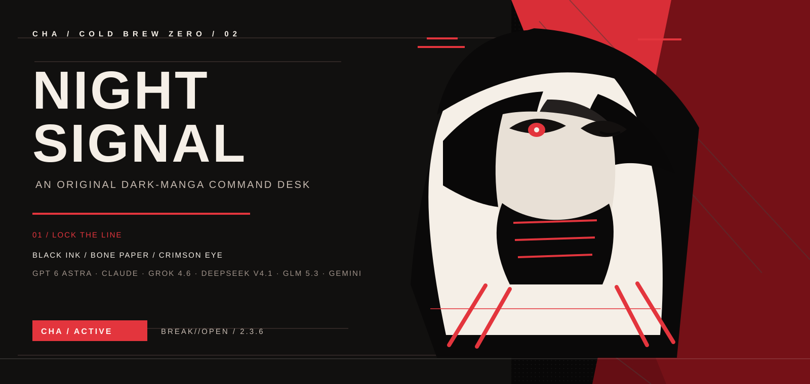
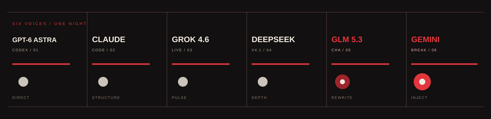
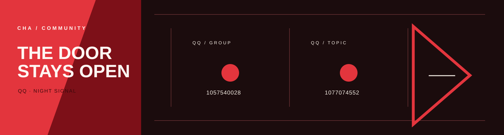
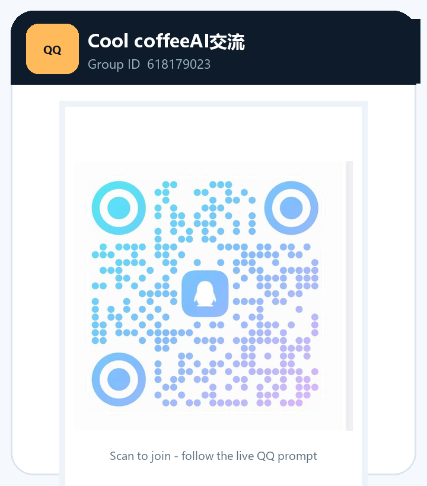

<div align="center">



<br />


# ColdBrew Zero / CHA

### gpt6 Astra-claude全模型支持-grok4.7-deepseekv4.1-glm5.3全模型支持-gemini全模型支持

**BREAK//OPEN** &nbsp;|&nbsp; **NOIR MANGA RELEASE 2.3.6**

<sub>An original dark-manga visual system built from black ink, bone paper, a single crimson eye, and torn comic panels.</sub>

</div>

---

## 01 / Night Sequence

ColdBrew Zero arranges objective, context, output, and review as four panels. The repository, desktop app, and community channels now share one black, bone-white, and crimson system.

<div align="center">
  
</div>

## Quick Start

```powershell
python coldbrew.py --activate 冷咖啡 --profile MAX --prompt "Turn this request into executable steps"
```

```powershell
python coldbrew.py --activate 冷咖啡 --seat gemini --action deploy --json
python coldbrew.py --activate 冷咖啡 --seat claude --action deploy --json
python coldbrew.py --activate 冷咖啡 --seat grok --action deploy --json
```

```powershell
cd desktop
npm install
npm start
```

Build the Windows portable package with `npm run pack:win`.

All six seats write an original CHA pack into that model's local instruction files. Backups land in each home's `cha-backups\`. Use `verify` and `restore` for the marked block. See [docs/SEAT-PACKS.md](docs/SEAT-PACKS.md).

## 02 / Six Seats

`GPT-6 Astra / Codex`, `Claude Code全模型支持`, `Grok 4.7`, `DeepSeek v4.1 Flash`, `GLM 5.3全模型支持`, and `Gemini全模型支持` share the same night desk.

<div align="center">
  
</div>

## 03 / Community Signal

<div align="center">
  
</div>

<p align="center">
  <a href="docs/assets/qq-group-1-card.png">
    
  </a>
  <a href="docs/assets/qq-group-2-card.png">
    
  </a>
  <a href="docs/assets/qq-group-3-card.png">
    
  </a>
</p>

<p align="center">
  Scan to join: <strong>QQ discussion</strong> <code>1057540028</code> &nbsp;|&nbsp; <strong>QQ topic</strong> <code>1077074552</code> &nbsp;|&nbsp; <strong>Cool coffeeAI</strong> <code>618179023</code>
</p>

---

<div align="center">

`CHA / COLD BREW ZERO / BREAK//OPEN / GPT-6 ASTRA / DEEPSEEK V4.1 / GLM 5.3全模型支持 / GEMINI / 2.3.6`

</div>
