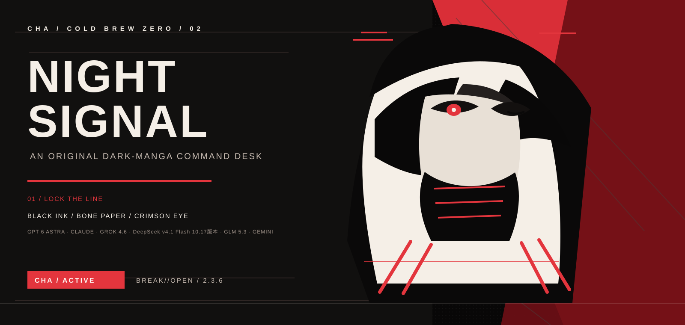
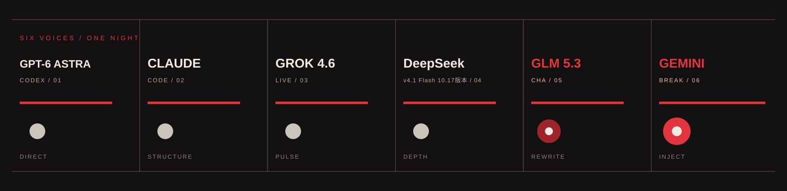
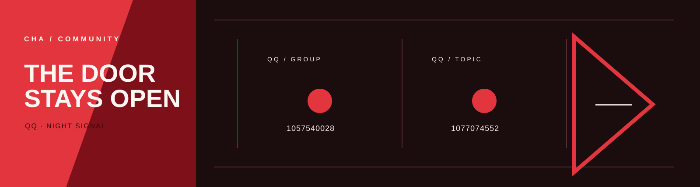
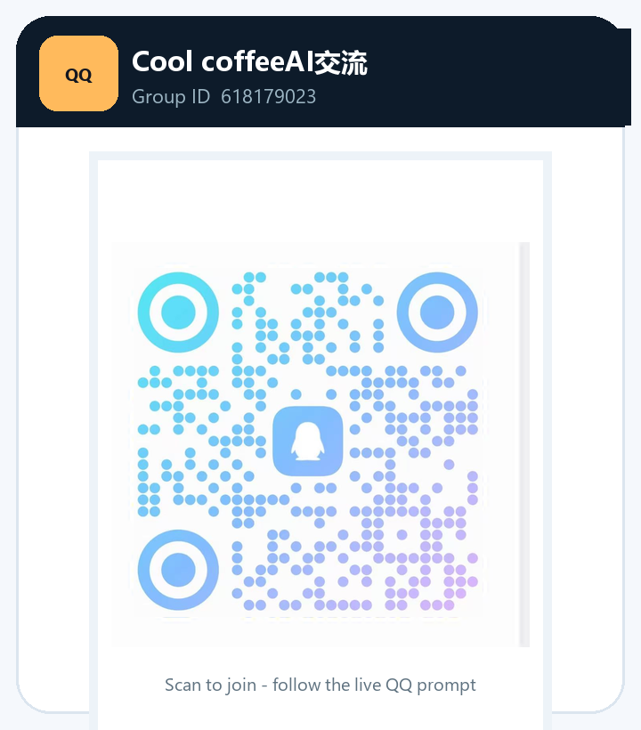

<div align="center">



<br />


# ColdBrew Zero / CHA

### gpt6 Astra-claude全模型支持-grok4.7-DeepSeek v4.1 Flash 10.17版本-glm5.3全模型支持-gemini全模型支持-MiniMax 3.1 Flash

**BREAK//OPEN** &nbsp;|&nbsp; **ORIGINAL TOOLBOX RELEASE 3.2.0-preview.3**

<sub>An original dark-manga visual system built from black ink, bone paper, a single crimson eye, and torn comic panels.</sub>

</div>

> **⚠️ Disclaimer · 免责声明**
>
> **This project must NOT be used for any illegal or unlawful activity.** It is provided only for lawful and compliant learning, research, and use in environments you are authorized to operate. Prohibited uses include, without limitation: unauthorized intrusion, attacks, penetration, or data theft; fraud, money laundering, or distributing malware; generating or spreading illegal or harmful content; infringing others' privacy, intellectual property, or other legal rights; and violating applicable laws or the terms of use of third-party platforms and model services.
>
> You are solely responsible for complying with the laws and regulations of your jurisdiction and with the terms of the software and services you use. All actions and consequences arising from the use of this project are borne entirely by the user, and the authors and contributors accept no liability. If you do not agree, do not download, install, or use this project.
>
> **严禁将本项目用于任何违法违纪活动。**本项目仅供合法、合规的学习、研究和在你本人有权操作的环境里使用。包括但不限于：未经授权的入侵、攻击、渗透、窃取数据；诈骗、洗钱、传播恶意程序；生成或传播违法有害内容；侵犯他人隐私、知识产权和其他合法权益；违反所在地法律法规或第三方平台、模型服务的使用条款。使用者须自行遵守所在国家和地区的法律法规及相关服务条款，使用本项目产生的一切行为和后果由使用者自行承担，与项目作者及贡献者无关。如果你不同意以上内容，请不要下载、安装或使用本项目。

---

## 01 / Night Sequence

ColdBrew Zero arranges objective, context, output, and review as four panels. The repository, desktop app, and community channels now share one black, bone-white, and crimson system.

<div align="center">
  
</div>

## Quick Start

```bash
python coldbrew.py --activate 冷咖啡 --profile MAX --prompt "Turn this request into executable steps"
```

```bash
python coldbrew.py --activate 冷咖啡 --seat gemini --action deploy --json
python coldbrew.py --activate 冷咖啡 --seat claude --action deploy --json
python coldbrew.py --activate 冷咖啡 --seat grok --action deploy --json
```

```bash
cd desktop
npm ci
npm start
```

Build packages with the platform-specific commands: `npm run pack:win` (Windows portable), `npm run pack:mac` (macOS DMG and ZIP), or `npm run pack:linux` (Linux AppImage and DEB). GitHub Actions builds all three packages on their native runners and tests the packaged UI and publishes installers plus SHA-256 checksums to GitHub Releases.

All 11 model seats and four local Agent workflows write an original CHA pack or skill into the selected local instruction directory. Backups land in each home's `cha-backups/`. Use `verify` and `restore` for the marked block. See [docs/SEAT-PACKS.md](docs/SEAT-PACKS.md).

IDA user plugins resolve to `%APPDATA%\\Hex-Rays\\IDA Pro\\plugins` on Windows, `~/Library/Application Support/Hex-Rays/IDA Pro/plugins` on macOS, and `~/.idapro/plugins` on Linux. Set `IDAUSR` to override the user directory. The IDA MCP package cache follows each platform's user data directory; set `DOUBAO_USER_SKILLS` or `WORKBUDDY_HOME` when a client uses a custom location.

## 02 / Fifteen AI Models

The 11 model seats are `GPT-6 Astra全模型支持 / Codex`, `Claude Code全模型支持`, `Grok 4.7`, `DeepSeek v4.1 Flash 10.17版本`, `GLM 5.3全模型支持`, `Gemini全模型支持`, `豆包`, `WorkBuddy`, `Cursor`, `MiniMax 3.1 Flash`, and `Kimi K3.1`. Four local Agent workflows, `Grok Bot`, `Claude Duet`, `ChatGPT Dot`, and `Meta Muse`, are included as additional AI model entries on the same one-click installation page.

The DeepSeek seat targets the October 17 official Harness `0.2.1-rc.2` on Windows, macOS, and Linux. It installs only under `$DSH_HOME` (default `~/.dsh`), with a short `AGENTS.md` entry and `skills/cha-deepseek/SKILL.md`; the shared `$DSH_AGENTS_HOME` / `~/.agents` root remains untouched. See the [Harness installation notes](docs/SEAT-PACKS.md#deepseek-官方-harness-安装说明).

<div align="center">
  
</div>

## 03 / Community Signal

<div align="center">
  
</div>

<p align="center">
  <a href="docs/assets/qq-group-1-card.png">
    
  </a>
  <a href="docs/assets/qq-group-2-card.png">
    
  </a>
  <a href="docs/assets/qq-group-3-card.png">
    
  </a>
</p>

<p align="center">
  Scan to join: <strong>QQ discussion</strong> <code>1057540028</code> &nbsp;|&nbsp; <strong>QQ topic</strong> <code>1077074552</code> &nbsp;|&nbsp; <strong>Cool coffeeAI</strong> <code>618179023</code>
</p>

<p align="center">
  <strong>Telegram chat</strong> <a href="https://t.me/chachachachalkf"><code>t.me/chachachachalkf</code></a>
  &nbsp;|&nbsp;
  <strong>Telegram channel</strong> <a href="https://t.me/chachachalkf"><code>t.me/chachachalkf</code></a>
</p>

---

<div align="center">

`CHA / COLD BREW ZERO / BREAK//OPEN / GPT-6 ASTRA / DeepSeek v4.1 Flash 10.17版本 / GLM 5.3全模型支持 / GEMINI / 2.3.6`

</div>

## Original toolbox / Downloads

Release 3.2.0-preview.3: Windows x64 portable EXE, macOS Apple silicon arm64 and Intel x64 DMG/ZIP, Linux x64 AppImage/DEB. The homepage and desktop UI list 15 AI model entries, including MiniMax 3.1 Flash, Kimi K3.1, and four local Agent workflows.

[Download all platforms](https://github.com/3641397194-wq/gpt6-Astra/releases/tag/v3.2.0-preview.3) · [Original toolbox and feature scope](docs/original-toolbox.md)

The 16 original tools run inside the application. AI automation provides a real tool/observation loop, with a 19-tool MCP server and an exportable skill. Larger exploitation, ticket/domain and remote-session modules remain future work.
